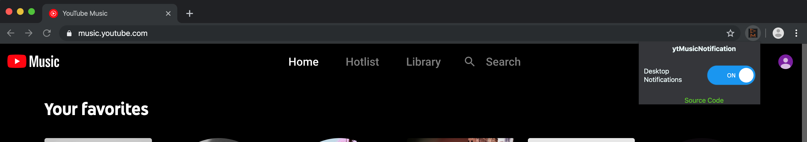
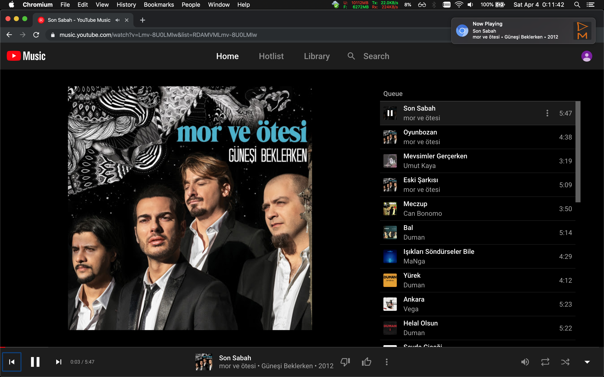

# ytMusicNotification

Chrome extension to get desktop notifications when the song changes in Youtube Music.

## Usage

After the extension installed, 

- Open [music.youtube.com](https://music.youtube.com) on your browser or open the PWA for Youtube Music.
- Activate the extension as shown in the image.

If the extension is active, a new desktop notification with info about the song will be displayed when song changes as shown in the image below.

## License
The source code is licensed under [GNU General Public License v3.0](./LICENSE).